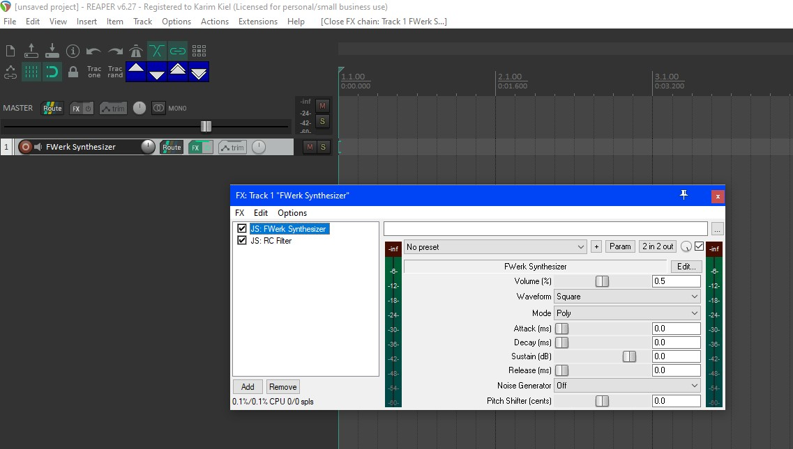

# FWerk Synthesizer, made for REAPER
https://www.reaper.fm/

The FWerk Synthesizer was a school project idea by me.
It was created between 13.02.2017 - 13.02.2017.
The goal for me was to create a simple synthesizer for my main DAW Reaper, which allows you to create your own plugin, known as Reaper JS, very similar to LUA. In Reaper, you are able to change these audio effects while running Reaper. Originally, Reaper does not come with any synthesizer written in JS (but in VST), so I took the chance to do that for myself. The advantage is a very small and changable code, efficient basic sounds and very lightweight.

Additionally I have added a small Filter plugin as well.

# HOW TO INSTALL:
- Reaper JS is only runnable inside Reaper, so you need to download it first. 
- Once installed, head to "Options" > "Show REAPER resource path in explorer/finder..."
- Open the folder "Effects"
- Now copy the "FWerk" folder into the "Effects" folder. 
- Re-open Reaper to make sure, it will be loaded.
- Go to "Insert" > "Virtual Instrument on new track"
- Search Fwerk and choose it. 

- For the filter plugin, search for "RC Filter"

# Libraries used:
www.taletn.com/reaper/mono_synth/

# Example Song made with Fwerk only (except drums)
https://soundcloud.com/metalfortress/undertale-bonetrousle-using-fwerk
